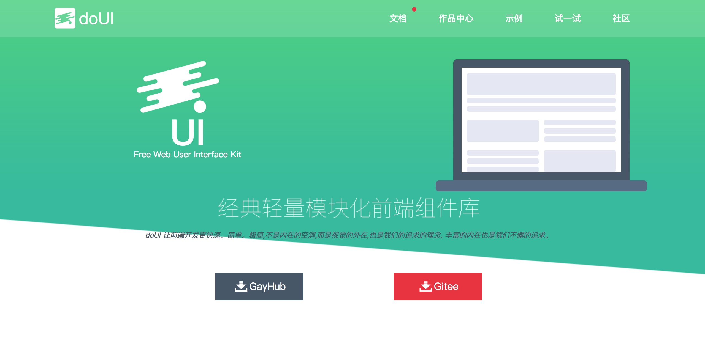

## wcUI 组件库
> wcUI组件库是基于`Web Components`开发的一套高效,轻量,可定制的现代化组件库。
>> 2.x版进行了大量重构, 专门适配支持 type=module的浏览器(着重于electron/node-webkit)。移除了原先对低版本浏览器的兼容代码, 更加高效。


##  亮点
> - 简洁, 没有过多的动画, 结构尽最大的能力做到扁平
> - 没有过多的API, 零配置也能美观
> - 恰到好处的样式穿透, 更契合有特殊需求的你
> - 基于WC, 很好的跑在`vue/react/angular/anot/jquery/native js`项目上...


## 开发进度&计划
- [x] 头像组件(`wc-avatar`)
- [x] 徽标组件(`wc-badge`)
- [x] codemirror插件(第三方插件,整合适配)
- [ ] 倒计时组件(`wc-counter`)
- [x] 拖拽指令(`drag.core`, 通用性插件)
- [x] 拖拽指令插件(`:drag`, anot.js专用)
- [x] 表单组件-按钮(`wc-button`)
- [x] 表单组件-复选框(`wc-checkbox`)
- [x] 表单组件-文本输入框(`wc-input`)
- [x] 表单组件-步进数字输入(`wc-number`)
- [x] 表单组件-评分(`wc-star`)
- [x] 表单组件-单选框(`wc-radio`)
- [x] 表单组件-下拉选择(`wc-select`)
- [ ] 表单组件-多级联动(`wc-cascadar`)
- [x] 表单组件-开关(`wc-switch`)
- [x] 图标组件(`wc-icon`)
- [x] 弹层插件(`layer`、`wc-layer`)
- [x] markdown组件(`wc-markd`)
- [x] md5(`md5`)
- [x] crypto(`crypto`)
- [ ] md文本编辑器(`wc-meditor`) 待重构...
- [x] 富文本编辑器(`wc-neditor`)
- [x] 分页组件(`wc-pager`)
- [ ] 颜色选择器(`wc-colorpicker`)
- [x] 日期选择器(`wc-datepicker`)
- [ ] 时间选择器(`wc-timepicker`)
- [x] 代码高亮插件(`wc-code`)
- [ ] 网络请求插件(`request`) 待重构...
- [ ] 路由插件(`router`) 待重构...
- [x] 滚动组件(`wc-scroll`)
- [ ] 滑块组件(`wc-silder`)
- [x] 进度条组件(`wc-progress`)
- [x] 数据管理插件(`store`)
- [ ] 树形菜单组件(`wc-tree`) 待重构...
- [ ] 上传组件(`wc-uploader`) 待重构...


## 开发环境及生产环境
```bash
# 开发环境, 仅编译,不压缩
npm start

# 生产环境, 编译且压缩
npm run prod

```
